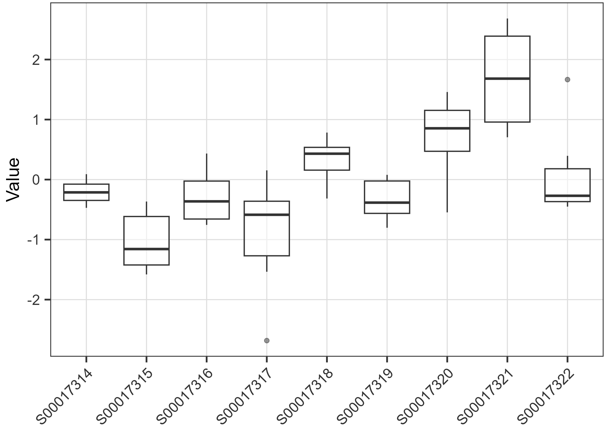

#INFORME
##1.DESCRIPCIÓ I JUSTIFICACIO DE LA BASE DE DADES
## He triat la database associada al projecte Metabolomics of Psoriasis.
## Aquesta pot consular-se en el repositori "Metabolomics workbench" amb l'identificador de projecte PR000239.
## He triat aquest tema perquè pateixo aquesta malaltia i m'ha causat curiositat #aprofundir en aquesta qüestió.
## Es tracta d'un estudi desenvolupat pel Departament de Dermatologia de la Universitat de Michigan, dirigit per l'investigador Johann Gudjonsson. L'objectiu de l'estudi és estudiar els metabolits esteroides en els teixits de pacients amb diferents estats de psoriasis. Per assolir-lo es van realitzar biòpsis per obtenir 9 mostres de pell que es van categoritzar en 3 subgrups:

#-Pell sana (3) -Pell afectada per psoriasis (3) -Pell no afectada en pacients amb psoriasis (3)

#A través de la cromatografía líquida acoplada a l'espectrometria de masses (LC-MS) es van analitzar les concentracions d'esteroides, expressades en pg/mg de teixit, caracteritzant d'aquesta manera els perfils metabòlics de cada mostra de pell.

```{r packages}
if (!require(plotly)) {
    install.packages("plotly")
    library(plotly)
}


if (!require(ggridges)) {
    install.packages("ggridges")
    library(ggridges)
}
if (!require(ggrepel)) {
    install.packages("ggrepel")
    library(ggrepel)
}
if (!require(ggforce)) {
    install.packages("ggforce")
    library(ggforce)
}

if (!require(kableExtra)) {
    install.packages("kableExtra")
    library(kableExtra)
}

if (!require(patchwork)) {
    install.packages("patchwork")
    library(ggridges)
}
if (!require(tidyr)) {
    install.packages("tidyr")
    library(tidyr)
}
if (!require(flextable)) {
    install.packages("flextable")
    library(flextable)
}
if (!require(officer)) {
    install.packages("officer")
    library(officer)
}
if (!require(pheatmap)) {
    install.packages("pheatmap")
    library(pheatmap)
}

paquets <- c("ggplot2", "ggridges", "dplyr", "tidyr", "patchwork")
paquets_no_instalats <- paquets[!paquets %in% installed.packages()[, "Package"]]
if(length(paquets_no_instalats)) install.packages(paquets_no_instalats)
suppressPackageStartupMessages(lapply(paquets, require, character.only = TRUE))
if(!require(jsonlite)){
    install.packages("jsonlite")
    library(jsonlite)}
if (!require("BiocManager", quietly = TRUE))
    install.packages("BiocManager")
if (!require("ggtext", quietly = TRUE))
    install.packages("ggtext")
if (!require("magrittr", quietly = TRUE))
    install.packages("magrittr")
if (!require("dplyr", quietly = TRUE))
    install.packages("dplyr")
if (!require("tidyr", quietly = TRUE))
    install.packages("tidyr")
if (!require("tibble", quietly = TRUE))
    install.packages("tibble")
if (!require("purrr", quietly = TRUE))
    install.packages("purrr")
if (!require("readr", quietly = TRUE))
    install.packages("readr")
if (!require("reshape2", quietly = TRUE))
    install.packages("reshape2")
if (!require("pheatmap", quietly = TRUE))
    install.packages("pheatmap")
if (!require("RColorBrewer", quietly = TRUE))
    install.packages("RColorBrewer")
library(reshape2)
library(pheatmap)
library(RColorBrewer)
if (!requireNamespace("SummarizedExperiment", quietly = TRUE)) {
  install.packages("SummarizedExperiment")
}
if (!requireNamespace("ggplot2", quietly = TRUE)) {
  install.packages("ggplot2")
}

BiocManager::install("Biobase")
BiocManager::install("POMA")
BiocManager::install("SummarizedExperiment")
library(POMA)
library(ggtext)
library(magrittr)
library(SummarizedExperiment)
library(readr)
library(purrr)
library(ggplot2)
```

```{r data_prep}

##### PREPARACIÓ I IMPORTACIÓ DE LES DADES ####

# Importar l'arxiu de dades '.json'

library(jsonlite)
json_data <-jsonlite::fromJSON("ST000298_AN000476.json", flatten = TRUE)
# Cerquem i resolem valors nuls #
null_values <- sapply(json_data, function(x) any(is.null(x)))
na_values <- sapply(json_data, function(x) any(is.na(x)))
# Print results
print("Valors nuls en:")
print(names(json_data)[null_values])

### Creació colData (info i factor mostres) ###
# Extraem la info de json_data
if (is.data.frame(json_data$SUBJECT_SAMPLE_FACTORS)) {
  sample_df <- json_data$SUBJECT_SAMPLE_FACTORS
} else {
  sample_info <- as.character(unlist(data$SUBJECT_SAMPLE_FACTORS))
  sample_df <- read.table(text = sample_info, sep = "\t", header = FALSE, stringsAsFactors = FALSE)
}
colnames(sample_df) <- c("Subject", "SampleID", "Factors")

# Associem els factors a columnes i creem colData#

# Crear un DataFrame de factores
factor_df <- data.frame(Factor = sample_df$Factors)

# Combinar con el DataFrame original
colData <- cbind(sample_df[, "SampleID", drop = FALSE], factor_df)

# Asignar nombres a las filas
row.names(colData) <- colData$SampleID

# Ver el resultado
head(colData)


### Extreuracció de dades metabòliques (fe) ###
# L'utilitzarem per a fer els anàlisi #

metabolite_data<-json_data$MS_METABOLITE_DATA$Data
metabolite_matrix <- as.data.frame(metabolite_data)
rownames(metabolite_matrix) <- metabolite_matrix$Metabolite
metabolite_matrix <- t(metabolite_matrix)
metabolite_matrix <- as.matrix(sapply(metabolite_matrix, as.numeric))
head(metabolite_matrix)


metabolite_data <- json_data$MS_METABOLITE_DATA$Data
metabolite_matrix <- as.data.frame(metabolite_data)
rownames(metabolite_matrix) <- metabolite_matrix$Metabolite
metabolite_matrix <- metabolite_matrix[, -1]  # Eliminar la columna redundant
metabolite_matrix[metabolite_matrix == ""] <- NA
metabolite_matrix <- as.matrix(sapply(metabolite_matrix, as.numeric))
head(metabolite_matrix)

#APROFITEM PER REVISAR VALORS FALTANTS O NULS
is.na(metabolite_matrix)
row_na_counts <- rowSums(is.na(metabolite_matrix))
# Mostrar metabolits amb NA
row_na_counts[row_na_counts > 0]

```

2.  CREAR OBJECTE 'SummarizedExperiment'
```{r SumExp}
# Comprovem que coincideixen les files

nrow(metabolite_matrix)
nrow(colData)

# Generm el SummarizedExperiment 

library(POMA)
poma_obj <- PomaCreateObject(
  metadata = colData,   
  features = metabolite_matrix 
)

# Verifiquem

poma_obj

```

3. AFEGIM METADADES GENERALS DEL PROJECTE (METADATA)

```{r Metadata}

# Afegim les metadades a l'objecte SummarizedExperiment
for (key in names(json_data$METABOLOMICS)) {
  metadata(poma_obj)$METABOLOMICS[[key]] <- json_data$METABOLOMICS[[key]]
}
for (key in names(json_data$PROJECT)) {
  metadata(poma_obj)$PROJECT[[key]] <- json_data$PROJECT[[key]]
}

for (key in names(json_data$STUDY)) {
  metadata(poma_obj)$STUDY[[key]] <- json_data$STUDY[[key]]
}

for (key in names(json_data$SUBJECT)) {
  metadata(poma_obj)$SUBJECT[[key]] <- json_data$SUBJECT[[key]]
}

for (key in names(json_data$SUBJECT_SAMPLE_FACTORS)) {
  metadata(poma_obj)$SUBJECT_SAMPLE_FACTORS[[key]] <- json_data$SUBJECT_SAMPLE_FACTORS[[key]]
}

for (key in names(json_data$COLLECTION)) {
  metadata(poma_obj)$COLLECTION[[key]] <- json_data$COLLECTION[[key]]
}

for (key in names(json_data$TREATMENT)) {
  metadata(poma_obj)$TREATMENT[[key]] <- json_data$TREATMENT[[key]]
}

for (key in names(json_data$SAMPLEPREP)) {
  metadata(poma_obj)$SAMPLEPREP[[key]] <- json_data$SAMPLEPREP[[key]]
}

for (key in names(json_data$CHROMATOGRAPHY)) {
  metadata(poma_obj)$CHROMATOGRAPHY[[key]] <- json_data$CHROMATOGRAPHY[[key]]
}

for (key in names(json_data$ANALYSIS)) {
  metadata(poma_obj)$ANALYSIS[[key]] <- json_data$ANALYSIS[[key]]
}

for (key in names(json_data$MS)) {
  metadata(poma_obj)$MS[[key]] <- json_data$MS[[key]]
}
for (key in names(json_data$MS_METABOLITE_DATA)) {
  metadata(poma_obj)$MS_METABOLITE_DATA[[key]] <- json_data$MS_METABOLITE_DATA[[key]]
}
metadata(poma_obj)
save(poma_obj, file = "summarized_experiment.rda")


```
4. REVISEM LA INFO DE L'OBJECTE
```{r revision}
sample_df <- json_data$SUBJECT_SAMPLE_FACTORS
colnames(sample_df) <- c("Subject", "SampleID", "Factors")

colData <- data.frame(
  Factor = sample_df$Factors,
  row.names = sample_df$SampleID
)

metabolite_data <- json_data$MS_METABOLITE_DATA$Data
rownames(metabolite_data) <- metabolite_data$Metabolite
metabolite_data <- metabolite_data[, -1]

assay_matrix <- as.matrix(metabolite_data)
mode(assay_matrix) <- "numeric"
assay_matrix <- assay_matrix[, rownames(colData), drop = FALSE]

poma_obj <- SummarizedExperiment(
  assays = list(counts = assay_matrix),
  colData = colData
)
is.na(assay(poma_obj))

#GRÀFIC DADES METABÒLITS

expr_matrix <- assay(poma_obj)
metabolite_means <- rowMeans(expr_matrix) #Calculem els valors mitjans
#Gràfic amb ggplot2
df_plot <- data.frame(
  Metabolite = rownames(expr_matrix),  
  MeanExpression = metabolite_means    
)
ggplot(df_plot, aes(x = reorder(Metabolite, MeanExpression), y = MeanExpression)) +
  geom_bar(stat = "identity", fill = "steelblue") +
  geom_text(aes(label = round(MeanExpression, 2)),  
            hjust = -0.2,  # Desplaçar les etiquetes a la dreta
            size = 4) +
  coord_flip() +  # Rotar el gràfic per millor visualització
  scale_y_continuous(expand = expansion(mult = c(0, 0.15))) +  # Espai addicional a la dreta
  labs(title = "Expressió mitjana dels metabolits",
       x = "Metabolit",
       y = "Expressió mitjana") +
  theme_minimal() +
  theme(plot.title = element_text(hjust = 0.5))  # Centrar el títol
##ALERTA, DADES NA en CORTICOSTERONE
```


DADES DESCRIPTIVES I NORMALITZACIÓ 

```{r summary}
library(flextable)
library(officer)
library(SummarizedExperiment)
library(ggplot2)
library(reshape2)

# SUMMARY
summary(assay(poma_obj))
summary_table <- summary(assay(poma_obj))

# Taula a df
summary_df <- as.data.frame(summary_table)
# Guardem la taula
table_flex <- flextable(summary_df) %>%
  theme_vanilla() %>%          # Estil
  autofit()                    # Ajusta
doc <- read_docx() %>%
  body_add_flextable(table_flex) %>%
  body_add_par("Resum de les dades per mostra", style = "heading 1") 

print(doc, target = "Resum_POMA.docx")


```


5. PRE-PROCESSAT DE LES DADES
Sí, cal normalitzar les dades. Treballarem amb log(poma_obj).
```{r exploration}
library(ggplot2)
# MISSING VALUES #

is.na(assay(poma_obj))

#Eliminem valors NA
poma_obj <- PomaImpute(poma_obj, method = "knn", zeros_as_na = TRUE, remove_na = TRUE, cutoff = 20)

sum(is.na(assay(poma_obj)))
row_na_counts <- rowSums(is.na(assay(poma_obj)))

# Mostrar metabolitos con valores faltantes
row_na_counts[row_na_counts > 0]


# CAL NORMALITZAR LES DADES? #

normalized <- poma_obj %>% PomaNorm(method = "log_pareto")
colData(normalized) <- colData(poma_obj)
normalized


# OUTLIERS ? #

# Extraer el factor de grupo (tratamientos) desde la estructura interna
colData(normalized)
group_factor <- normalized@colData@listData$Factor
group_factor <- factor(group_factor)
# Plot poligonal
p10<-PomaOutliers(normalized)$polygon_plot
p10
# Boxplot 
outlier_results2 <- normalized %>% 
  PomaOutliers(method = "euclidean",
               type = "median",
               outcome = "Factor",
               coef = 2,
               labels = FALSE)
outlier_results2
#Valors exactes outliers
data_matrix <- assay(normalized)

# Calcular els llindars d'outlier (1r i 3r quartil ± 1.5 * IQR)
find_outliers <- function(x) {
  Q1 <- quantile(x, 0.25, na.rm = TRUE)
  Q3 <- quantile(x, 0.75, na.rm = TRUE)
  IQR_val <- Q3 - Q1
  lower_bound <- Q1 - 1.5 * IQR_val
  upper_bound <- Q3 + 1.5 * IQR_val
  return(which(x < lower_bound | x > upper_bound))  # Retorna les posicions dels outliers
}

# Aplicar a totes les files
outliers_list <- apply(data_matrix, 1, find_outliers)
outliers_list

## BOXPLOTS ##

p1 <- PomaBoxplots(poma_obj, x = "samples", feature_name = NULL)
p2 <- PomaBoxplots(normalized, x = "samples", feature_name = NULL)

ggsave("PomaBoxplots.png", plot = p1)

ggsave("PomaBoxplotsNORM.png", plot = p2)



# Mostrar los gráficos
print(p1)
print(p2)


## DENSITY ##

#Arreglem els noms dels metabòlits que apareixen malament

feature_names <- json_data$MS_METABOLITE_DATA$Data$Metabolite
print(head(feature_names))
feature_names<-feature_names[-5]
length(feature_names)
length(assays(poma_obj))
# Asegurarte de que la longitud de 'feature_names' coincida con el número de filas de tu matriz de expresión
if (length(feature_names) == nrow(assays(poma_obj)[[1]])) {
  # Asignar los nuevos nombres a las características en el objeto SummarizedExperiment
  rownames(assays(poma_obj)[[1]]) <- feature_names
} else {
  stop("La longitud de los nombres de las características no coincide con el número de filas en la matriz de expresión.")
}

# Verifica los nuevos nombres de las características
print(rownames(assays(poma_obj)[[1]]))


p4<-PomaDensity(poma_obj, x = "features")
p5<-PomaDensity(normalized, x = "features")

ggsave("PomaDensity.png", plot = p4)
knitr::include_graphics("PomaDensity.png")
ggsave("PomaDensityNORM.png", plot = p5)
knitr::include_graphics("PomaDensityNORM.png")
```

5. ANÀLISI DESCRIPTIU I ESTADÍSTIC
5.1 EXPLORACIÓ DE LES DADES
```{r data_exploration}
assay_data <- assay(poma_obj)
assay(poma_obj, withDimnames = FALSE) <- assay_data
colnames(assay(poma_obj))
assay_t<-t(log(assay_data))

### Correlació entre els metabòlits? ###

#Matriu de correlació

corr_matrix <- cor(assay_t)
corr_melted <- melt(corr_matrix)
corr_matrix

# Heatmap metabolits

p6<-ggplot(corr_melted, aes(Var1, Var2, fill = value)) +
  geom_tile() +
  scale_fill_gradient2(low = "blue", mid = "white", high = "red", midpoint = 0) +
  theme_minimal() +
  labs(title = "Heatmap de Correlació", fill = "Correlació") +
  theme(axis.text.x = element_text(angle = 45, hjust = 1))

ggsave("HeatmapMetabol.png", plot = p6)


### Perfils metabolòmics pareguts entre dades? ###

## Heatmap metabolits i mostres by tractament ##

# Anotem les mostres per tractament
tractaments <- data.frame(Tipus_Teixit = c("PsInv", "PsInv", "PsInv",
                                               "PsUn", "PsUn", "PsUn",
                                               "Norm", "Norm", "Norm"))
rownames(tractaments) <- colnames(assay_data)  # Nombres de las Mostras deben coincidir

# Definir colors per tractament
library(RColorBrewer)
colors_tractament <- list(Tipus_Teixit = c("PsInv" = "#FF9933","PsUn"="#FF99CC" , "Norm" = "#999"))

# Generar el heatmap con anotaciones y colores de grupos
p7<-pheatmap(as.matrix(assay_data), 
         annotation_col = tractaments,  # Anotación para columnas (Mostras)
         annotation_colors = colors_tractament,  # Colores por grupo
         scale = "row",  # Normaliza los valores por fila (metabolitos)
         color = colorRampPalette(c("blue", "white", "red"))(100),  # Esquema de colores del heatmap
         clustering_distance_rows = "euclidean", 
         clustering_distance_cols = "euclidean",
         clustering_method = "complete",
         main = "Heatmap de metabolits vs mostres i tractament")

ggsave("HeatmapFull.png", plot = p7)

p7
## Perfils de les mostres per tractament ##
tractaments <- data.frame(
  Mostra = rownames(assay_t),  
  Tractament = rep(c("PsInv", "PsUn", "Norm"), each = 3)  
)
assay_t <- as.data.frame(assay_t)  # Convertimos assay_t a dataframe si no lo es
assay_t$Tractament <- tractaments$Tractament  # Añadir la columna 'Tractament'
assay_t$Mostra <- tractaments$Mostra
head(assay_t)
assay_t_long <- assay_t %>%
  pivot_longer(cols = -c(Tractament,Mostra),  # Mantener 'Tractament' como columna fija
               names_to = "Metabolit", 
               values_to = "Concentracio")  # Los metabolitos se convierten en filas
```

PCA

```{r pca}
#Definim els factors
assay_t$Tractament<-as.factor(assay_t$Tractament)
assay_t$Mostra<-as.factor(assay_t$Mostra)
str(assay_t)
summary(assay_t)

#Separem les variables numèriques
assay_t_numeric <- assay_t[, sapply(assay_t, is.numeric)]

# Matriu de correlació #
cor_matrix <- cor(assay_t_numeric, use = "pairwise.complete.obs", method = "pearson")
print(cor_matrix)
cor_table <- as.data.frame(round(cor_matrix, 2))  # Redondear a 2 decimales

# La guardem en Taula #
kable(cor_table, caption = "Matriz de Correlación de las Variables Numéricas") %>%
  kable_styling(bootstrap_options = c("striped", "hover", "condensed", "responsive"))

# Matriu de covariàncies #

assay_t_numeric <- assay_t[, sapply(assay_t, is.numeric)]
cov_matrix <- cov(assay_t_numeric, use = "pairwise.complete.obs")
print(cov_matrix)

# Fem la PCA de manera més ràpida amb 'prcomp'

pca_result <- prcomp(assay_t_numeric, scale. = TRUE)
summary(pca_result)

PCAS1 <- pca_result$x[, 1]  # Primera PC
PCAS2 <- pca_result$x[, 2]  # Segona PC
PCAS1
PCAS2

# Plot de la PCA
pca_df <- data.frame(
  PC1 = pca_result$x[, 1],
  PC2 = pca_result$x[, 2],
  Muestra = rownames(assay_t_numeric),
  Tractament = assay_t$Tractament  # Assegura't que aquest factor estigui correctament assignat
)

# Colors personalitzats per cada tractament
colors_trat <- c("PsInv" = "#FF9933","PsUn"="#FF99CC" , "Norm" = "#999")

#  Gràfic de PCA vs metabòlits #

p8<-ggplot(pca_df, aes(x = PC1, y = PC2, color = Tractament, shape = Tractament)) +
  geom_point(size = 4, alpha = 0.8) +  # Punts
  geom_text_repel(aes(label = Muestra), size = 4, color = "black", max.overlaps = Inf) +  # Etiquetes
  geom_mark_ellipse(aes(fill = Tractament), alpha = 0.1, show.legend = FALSE) +  # El·lipses
  scale_color_manual(values = colors_trat) +  # Assignació de colors personalitzats
  scale_shape_manual(values = c(16, 17, 15)) +  # Formes diferents per tractaments
  theme_minimal() +
  labs(title = "PCA de Metabòlits",
       x = paste0("PC1 (", round(summary(pca_result)$importance[2, 1] * 100, 1), "%)"),
       y = paste0("PC2 (", round(summary(pca_result)$importance[2, 2] * 100, 1), "%)")) +
  expand_limits(x = c(min(pca_df$PC1) - 1, max(pca_df$PC1) + 1),
                y = c(min(pca_df$PC2) - 1, max(pca_df$PC2) + 1)) +  # Ampliar marges
  coord_fixed(ratio = 1.2) +  # Ajusta la relació entre eixos
  theme(legend.position = "right",
        plot.title = element_text(size = 14, face = "bold"))

ggsave("PCA.png", plot = p8)


```


